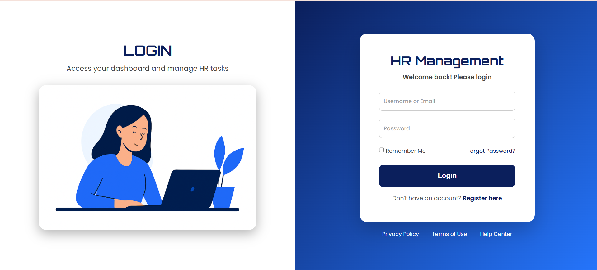
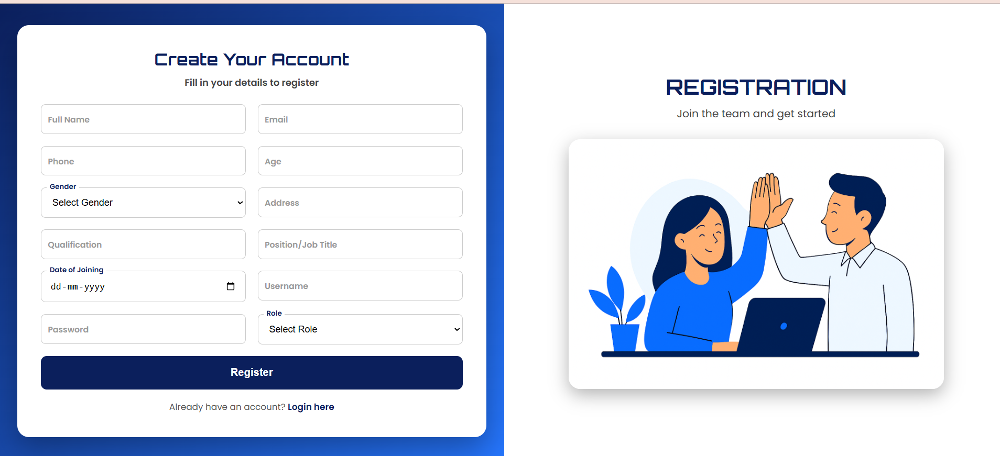
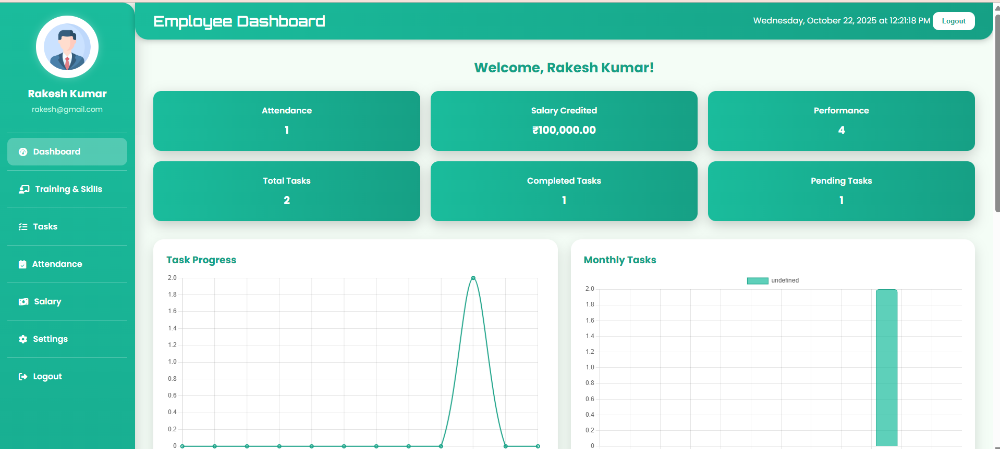
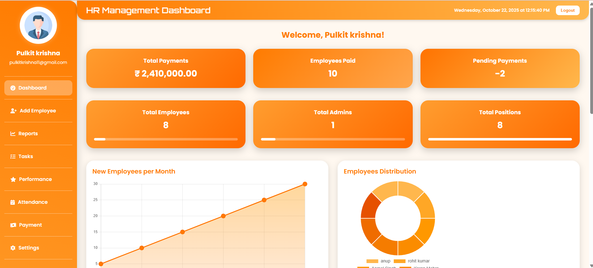

#  HR Management System

[ Live Demo](https://hr-management-dashboard.great-site.net)

A complete HR Management web application built using **PHP, MySQL, HTML, CSS, and JavaScript**.  
This project is designed to simplify employee data management, attendance tracking, and salary calculation — all through a responsive and user-friendly dashboard.

---

##  Project Preview

### Login Page

### Register Page

### Employee Dashboard

### Admin Dashboard

!

---

##  Features

-  **Role-based Login System** — Separate dashboards for Admin and Employees  
-  **Employee Management** — Add, Edit, Delete employee records  
-  **Salary Management** — Generate and manage employee salary reports  
-  **Attendance Tracking** — Monitor employee attendance  
-  **Admin Dashboard** — Overview of all HR operations  
-  **Responsive Design** — Works smoothly across devices  
-  **MySQL Database Integration** — Secure data storage and retrieval  

---

##  Tech Stack

| Category | Technologies Used |
|-----------|-------------------|
| Frontend  | HTML, CSS, JavaScript |
| Backend   | PHP |
| Database  | MySQL |
| Tools     | XAMPP / WAMP, VS Code, phpMyAdmin |

---

##  Folder Structure
├── admin/ # Admin dashboard files
├── employee/ # Employee dashboard files
├── auth/ # Login and registration pages
├── assets/ # CSS, JS, and image files
├── db/ # Database connection and SQL file
├── index.php # Homepage
├── README.md # Project documentation
└── hr_management.sql # Database structure

