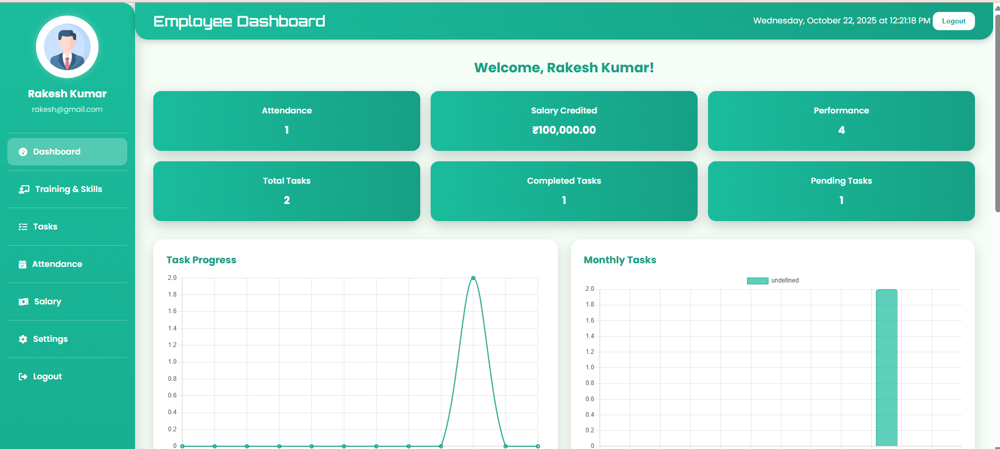
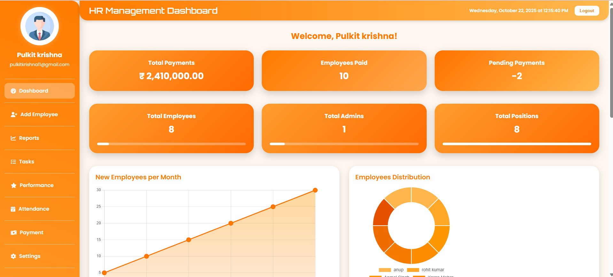

# 💼 HR Management System

# 💼 HR Management System

[🌐 Live Demo](https://hr-management-dashboard.great-site.net)

A complete HR Management web application built using **PHP, MySQL, HTML, CSS, and JavaScript**.

A complete HR Management web application built using **PHP, MySQL, HTML, CSS, and JavaScript**.  
This project is designed to simplify employee data management, attendance tracking, and salary calculation — all through a responsive and user-friendly dashboard.

---

## 📸 Project Preview

### Login Page

### Register Page

### Employee Dashboard

### Admin Dashboard

!

---

## 🚀 Features

- 🔐 **Role-based Login System** — Separate dashboards for Admin and Employees  
- 👥 **Employee Management** — Add, Edit, Delete employee records  
- 💰 **Salary Management** — Generate and manage employee salary reports  
- 🕒 **Attendance Tracking** — Monitor employee attendance  
- 📊 **Admin Dashboard** — Overview of all HR operations  
- 🖥️ **Responsive Design** — Works smoothly across devices  
- 🗄️ **MySQL Database Integration** — Secure data storage and retrieval  

---

## 🧠 Tech Stack

| Category | Technologies Used |
|-----------|-------------------|
| Frontend  | HTML, CSS, JavaScript |
| Backend   | PHP |
| Database  | MySQL |
| Tools     | XAMPP / WAMP, VS Code, phpMyAdmin |

---

## 📂 Folder Structure
├── admin/ # Admin dashboard files
├── employee/ # Employee dashboard files
├── auth/ # Login and registration pages
├── assets/ # CSS, JS, and image files
├── db/ # Database connection and SQL file
├── index.php # Homepage
├── README.md # Project documentation
└── hr_management.sql # Database structure

